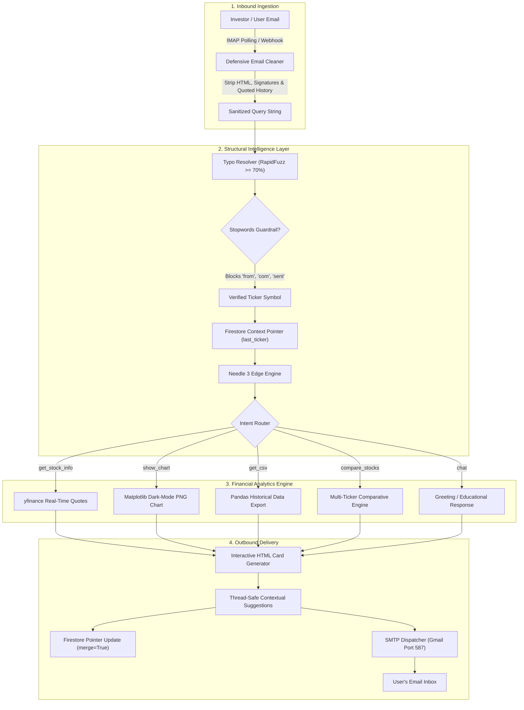

# 📈 Edge-AI Stock Email Bot: Complete Architecture & Implementation Guide

> An ultra-lightweight, production-ready, conversational financial email assistant powered by **Edge AI (Needle 3 / Cactus Compute)** and **Yahoo Finance**. Engineered for **near-zero infrastructure cost**, **zero cloud LLM API bills**, and a **sub-28 MB RAM footprint**.

---

## 📖 Table of Contents
1. [Core Philosophy: Why Edge AI instead of Cloud LLMs?](#-core-philosophy-why-edge-ai-instead-of-cloud-llms)
2. [High-Level System Architecture](#-high-level-system-architecture)
3. [Component Breakdown](#-component-breakdown)
   - [1. Structural Intelligence Layer (Needle 3 Tool Router)](#1-structural-intelligence-layer-agentpy)
   - [2. Typo-Resilient Mapping & Stopwords Protection](#2-typo-resilient-mapping-matcherpy)
   - [3. Downstream Financial Engine & Visuals](#3-downstream-financial-engine--visuals-marketpy)
   - [4. State Persistence & Context Memory](#4-state-persistence--context-memory-storagepy)
   - [5. Email Transmission & Defensive Parsing](#5-email-transmission--defensive-parsing-email_servicepy)
   - [6. Interactive In-Email UI (Quick Action Buttons)](#6-interactive-in-email-ui-quick-action-buttons)
4. [File & Directory Structure](#-file--directory-structure)
5. [Getting Started & Local Setup](#-getting-started--local-setup)
6. [Hugging Face Spaces Cloud Deployment](#-hugging-face-spaces-cloud-deployment)
7. [Security & Privacy Guardrails](#-security--privacy-guardrails)

---

## 💡 Core Philosophy: Why Edge AI instead of Cloud LLMs?

Traditional AI applications rely on heavy cloud LLMs (OpenAI GPT-4, Google Gemini, Anthropic Claude). While great for open-ended creative writing, cloud LLMs introduce critical flaws for automated financial bots:
* **Ongoing API Invoices:** Pay-per-token pricing models quickly accumulate recurring costs.
* **Rate Limits & Downtime:** Free tiers throttle requests or expire completely.
* **Hallucination Risk:** Generative language models frequently invent fake stock prices or invalid ratios.
* **Massive Footprint:** Running full local LLMs requires 16+ GB of VRAM and high-tier GPUs.

### The Edge Solution:
Instead of treating the AI as an essay writer, we deploy an **Action & Tool-Calling Foundation Model (Needle 3)**:
* **Ultra-Lightweight Footprint:** Operates completely on basic CPU in **under 28 MB of RAM**.
* **Zero Cloud Bills ($0.00 Forever):** Operates on-device without external token charges.
* **100% Mathematically Accurate:** The AI acts as a **structural switchboard** that extracts user intent (`get_stock_info`, `show_chart`, `get_csv`, `compare_stocks`), while verified Python data engines (`yfinance`, `matplotlib`, `pandas`) supply real-time numbers and graphics without hallucination.

---

## 🏗️ High-Level System Architecture



---

## 🧩 Component Breakdown

### 1. Structural Intelligence Layer (`agent.py`)
Acts as the central router that converts unstructured user text into verified system calls.
* **Supported Schemas:**
  * `get_stock_info(symbol)`: Retrieves real-time prices, percentage changes, day range, 52-week range, and P/E ratios.
  * `show_chart(symbol, period)`: Generates high-resolution PNG price and volume trend plots.
  * `get_csv(symbol, period)`: Exports multi-session historical data into a spreadsheet.
  * `compare_stocks(symbols, period)`: Side-by-side performance analysis (enforces a hard limit of **maximum 2 tickers** to prevent chart clutter).
  * `chat`: Fallback for greetings (*"hi"*, *"hello"*) or parameter education (e.g., asking to compare 3+ tickers).
* **Pronoun & Context Continuation:** If a user first inquires about Apple and then sends *"Show me its chart"*, the agent inspects the user's metadata pointer in storage and resolves *"its"* to `AAPL`.

---

### 2. Typo-Resilient Mapping (`matcher.py`)
Because on-device edge models prioritize tool syntax over vast text vocabularies, `matcher.py` normalizes informal company names and noisy typos into official stock tickers.
* **Priority Matching:** Primary companies (*Apple $\rightarrow$ AAPL*, *Tesla $\rightarrow$ TSLA*, *Google $\rightarrow$ GOOGL*, *Nvidia $\rightarrow$ NVDA*) are evaluated first.
* **Stopwords Protection:** Explicitly ignores common conversational words and email artifacts (*from, com, org, net, price, stock, cost, send, me, for*) to prevent false ticker triggers (e.g. preventing the word `.com` or `from` from colliding with Salesforce `CRM`).
* **Probabilistic Threshold:** Uses `rapidfuzz.process.extractOne` with a conservative **$\ge 70\%$ confidence threshold** to correct genuine misspellings (*"gool"* $\rightarrow$ *GOOGL*, *"amazn"* $\rightarrow$ *AMZN*).

---

### 3. Downstream Financial Engine & Visuals (`market.py`)
* **Real-Time Data:** Direct integration with `yfinance` to pull live prices, previous closes, daily high/lows, and market capitalization.
* **Professional Single Stock Analysis Chart:** Built on headless `matplotlib` (`Agg` backend). High-resolution (150 DPI) 2-panel chart featuring:
  * Solid emerald green `Close Price` line with translucent green area fill down to 0 baseline.
  * Orange dashed **20-day Moving Average** and purple dashed **50-day Moving Average** (with historical backfill so MAs are smooth from day 1).
  * Horizontal dotted reference line at current price.
  * Color-coded daily volume bars (green for up days, red for down days) formatted in Millions (`M`) and Thousands (`K`).
  * Subtitle statistics: `Current: $X | Change: +Y% | High: $Z | Low: $W`.
* **2-Stock Comparative Performance Chart:** 3-panel comparative layout featuring:
  * Top full-width panel: Normalized `% Change from Start` with 0% dashed baseline, dual stock curves, and shaded +/- area fills above/below 0. Custom legend: `{TICKER1} 📈 (+X.XX%)` vs `{TICKER2} 📉 (-Y.YY%)`.
  * Bottom side-by-side subplots: Mini price curves and color-coded daily volume bars for each ticker.
* **Merged Multi-Stock CSV Exporter:** Aligns both stocks by `Date` (sorted ascending) with formatted column headers: `{TICKER}_Close_{TICKER}, {TICKER}_High_{TICKER}, {TICKER}_Low_{TICKER}, {TICKER}_Open_{TICKER}, {TICKER}_Volume_{TICKER}`.

---

### 4. State Persistence & Context Memory (`storage.py`)
Hugging Face Space containers sleep and restart periodically. Standard in-memory variables are lost upon container sleep.
* **Zero Row Accumulation:** Operates on **Firebase Firestore** using key-value document overwrites with `merge=True`.
* **Minimal Data Footprint:** Tracks only three lightweight pointers per user email:
  ```json
  {
    "last_ticker": "AAPL",
    "last_action": "get_stock_info",
    "updated_at": "2026-09-20T19:00:00Z"
  }
  ```
* **Offline / Local Fallback:** If `FIREBASE_CREDENTIALS_JSON` is not provided during local testing, it automatically defaults to an in-memory dictionary so local execution never crashes.

---

### 5. Email Transmission & Defensive Parsing (`email_service.py`)
* **Inbound (IMAP):** Connects via SSL over port 993 to check for `UNSEEN` messages.
* **Defensive Sanitation:**
  * Strips HTML markup (`<style>`, `<script>`, `<tags>`).
  * Cuts off quoted email threads (lines starting with `>` or `On ... wrote:`) so the bot never re-reads previous bot responses.
  * Ignores emails sent from the bot's own address (`stonks.gro@gmail.com`) to prevent infinite automated loops.
* **Outbound (SMTP):** Sends replies over TLS (port 587) using `MIMEMultipart`, seamlessly attaching `.png` charts and `.csv` files.

---

### 6. Interactive In-Email UI (Thread-Safe Follow-up Suggestions)
To maintain 100% conversation continuity in the same Gmail/Outlook thread, our bot renders **contextual quick follow-up question cards**:

```html
<!-- Thread-Safe Follow-Up Suggestion -->
<div style="background-color: #ffffff; border: 1px solid #cbd5e1; border-radius: 6px; padding: 7px 12px; font-size: 13px; font-weight: 500;">
    💬 &ldquo;Show 6 month chart for AAPL&rdquo;
</div>
```

* **Zero Thread Splitting:** Avoids disruptive `mailto:` URLs that force open separate compose drafts and break email thread continuity.
* **Native Thread Continuity:** Instructs users to hit the native **Reply** button in their email client, automatically preserving `In-Reply-To`, `References`, and normalized `Re: Subject` headers.
* **Contextual Suggestions:** Pre-computes intelligent follow-ups based on the user's latest query (e.g. 6-month chart, 1-year historical CSV, comparative stock analysis).

---

## 📁 File & Directory Structure

```
e:\code\stock\
├── .env                  # Private credentials (Gmail, App Password, Firestore key)
├── .env.example          # Safe template for version control
├── .gitignore            # Protects secrets, venvs, and cache files
├── requirements.txt      # Open-source Python dependencies
├── matcher.py            # Typo-resilient fuzzy resolver & stopwords filter
├── storage.py            # Firestore persistent context manager (merge=True)
├── market.py             # Yahoo Finance extraction & Matplotlib chart renderer
├── agent.py              # Needle 3 Structural Intelligence Layer
├── email_service.py      # IMAP email listener & SMTP sender with quote-stripping
├── stock_bot.py          # Standalone background email bot listener
├── main.py               # FastAPI webhook server for cloud deployments
├── Dockerfile            # Lightweight CPU container spec for Hugging Face Spaces
├── README.md             # Architecture blueprint & setup documentation
└── test_bot.py           # Automated unit test suite
```

---

## 🚀 Getting Started & Local Setup

### 1. Prerequisites
* Python 3.11+
* A Gmail account with 2-Step Verification enabled.

### 2. Installation
Activate your virtual environment and install the required dependencies:
```powershell
# Activate your environment
stocks\Scripts\Activate.ps1

# Install pinned dependencies
pip install -r requirements.txt
```

### 3. Configure Credentials in `.env`
Create or edit your [`.env`](file:///e:/code/stock/.env) file:
```ini
# Gmail Account to receive and send emails
EMAIL_ADDRESS=stonks.gro@gmail.com

# 16-character Google App Password (https://myaccount.google.com/apppasswords)
EMAIL_PASSWORD=your_16_char_password

# Outbound & Inbound Server Settings
SMTP_SERVER=smtp.gmail.com
SMTP_PORT=587
IMAP_SERVER=imap.gmail.com
IMAP_PORT=993
EMAIL_CHECK_INTERVAL=5

# Optional: Firebase Service Account Key (for persistent cloud storage)
FIREBASE_CREDENTIALS_JSON=okso-5d0d0-firebase-adminsdk-fbsvc-5f515b88d3.json
```

### 4. Running the Bot Locally
To start the live email listener:
```powershell
python stock_bot.py
```
Send an email from your phone or personal address to **`stonks.gro@gmail.com`**:
* **Subject:** `Apple`
* **Body:** `What is Apple's price today?`

Watch your terminal log the incoming message and deliver the financial card back to your inbox in seconds!

---

## ☁️ Hugging Face Spaces Cloud Deployment

This repository is **100% pre-configured for free 24/7 deployment** on **Hugging Face Spaces** (Free CPU / Docker Tier):

1. **Create a Space**: Go to [Hugging Face Spaces](https://huggingface.co/spaces) $\rightarrow$ **Create new Space**.
   * Space Name: `stock-email-bot`
   * License: `MIT` / `Apache 2.0`
   * Space SDK: **Docker** (Blank)
   * Hardware: **CPU Basic (Free 2 vCPU · 16 GB RAM)**
2. **Add Secrets & Environment Variables**:
   In your Space **Settings** $\rightarrow$ **Variables and secrets**, add your credentials:
   * **Secret**: `EMAIL_ADDRESS` $\rightarrow$ Your Gmail address (e.g. `stonks.gro@gmail.com`)
   * **Secret**: `EMAIL_PASSWORD` $\rightarrow$ Your 16-character Google App Password
   * **Secret** *(Optional)*: `FIREBASE_CREDENTIALS_JSON` $\rightarrow$ Paste service account key filename or JSON for persistent multi-turn memory
   * **Variable** *(Optional)*: `EMAIL_CHECK_INTERVAL` $\rightarrow$ `10` (checks inbox every 10 seconds)
3. **Push Repository**:
   ```bash
   git remote add space https://huggingface.co/spaces/YOUR_USERNAME/stock-email-bot
   git push space main
   ```
4. **Autonomous Cloud Operation**:
   Once built, Hugging Face Spaces automatically:
   * Runs the **FastAPI Web Dashboard** on port 7860 with live interactive query testing.
   * Runs the **Continuous IMAP Email Listener** in a background daemon thread listening to your Gmail inbox 24/7!
   * **You can close your computer/terminal completely** — your bot will autonomously receive emails, generate high-res charts and CSVs, and reply in the same Gmail thread from the cloud!

---

## 🔒 Security & Privacy Guardrails

1. **Zero Secret Leakage:**
   * [`.gitignore`](file:///e:/code/stock/.gitignore) strictly prevents `.env`, `*firebase*.json`, and `*adminsdk*.json` from ever being pushed to public repositories.
2. **Infinite Loop Prevention:**
   * `email_service.py` verifies the sender header and discards any messages originating from the bot's own address.
3. **Quoted Thread Isolation:**
   * All email responses strip previous reply threads (`> ...`), preventing circular context degradation.
4. **Data Isolation:**
   * Firebase keys and tokens are stored in environment variables, never hardcoded into source code.
